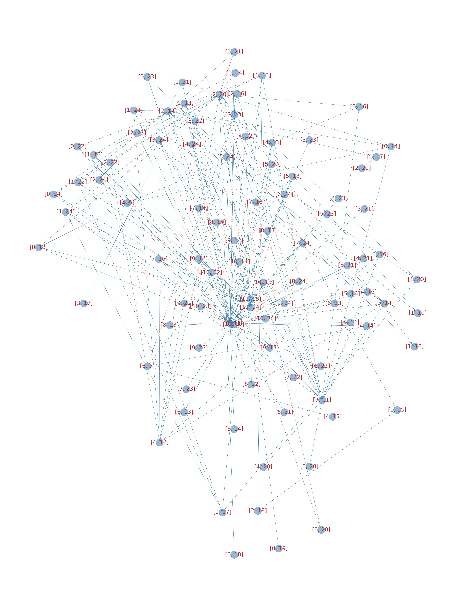

# Detecting any language skills of LLMs  

This is a demo with implementation on GPT2-XL, mastering the paper "Unveiling Language Skills under Circuits" 

## citation
our paper: "Unveiling Language Skills under Circuits" and preprint: https://arxiv.org/abs/2410.01334
```
@misc{chen2024unveilinglanguageskillscircuits,
      title={Unveiling Language Skills under Circuits}, 
      author={Hang Chen and Jiaying Zhu and Xinyu Yang and Wenya Wang},
      year={2024},
      eprint={2410.01334},
      archivePrefix={arXiv},
      primaryClass={cs.CL},
      url={https://arxiv.org/abs/2410.01334}, 
}
```


## Skill Graph 

Previous Token Skill  


Induction Token Skill  


ICL1 Skill  


ICL2 Skill  


ICL3 Skill  


ICL4 Skill  


## requirements
just some common packages 
```
torch  
transformers  
tqdm  
matplotlib  
sklearn  
```
(from my side, requirement.text is not good as install when no-package and I'm lazy )
## quick start
To get previous token skill: 
```
python language_skill_pt.py --task_name language_skill --case_type previous_token_2t
```

To get Induction skill:  
(not recommondate, there are many source files of induction skill failing to upload) 
```
python language_skill_inductive.py --task_name language_skill
```

To get ICL1 skill: 
```
python language_skill_icl.py --task_name language_skill 
```

To get other ICL skills, please edit the directory (line 20, 51, 81, 196 in language_skill_icl.py)

## If you want to start from collect G*
the greedy search is in token_by_token.py 
to get G* from samples of previous token skill
```
python token_by_token_pt.py --task_name token_by_token --case_type orca1wc [or orca2wc]
```
Sure, you can create data samples as json file as you like (we created it by orca_dataset_to_json.py)

to get G* from samples of Induction skill
```
python token_by_token_pt.py --task_name token_by_token --case_type orcainductive
```
Sure, you can create data samples as you like  

to get G* from samples of ICL skill 
```
python token_by_token_icl.py --task_name token_by_token --case_type [icl_sst2, icl_oc, icl_qawiki, icl_raco]
```

We encourage you to create data samples by yourselves 

after you finish collect G*, you can use language_skill.py again

## Other files
FYI, the other files either perform some small functions or are some small experiments of my own.  

## citation 
moment no


        
